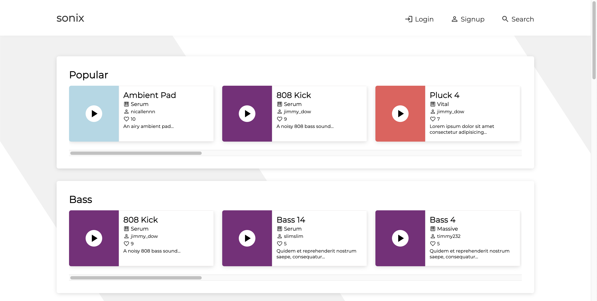
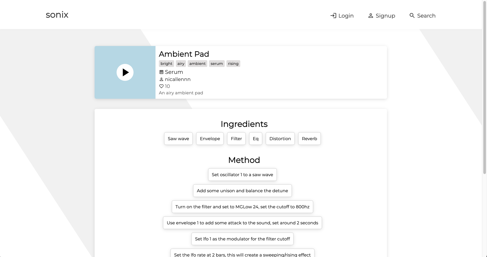
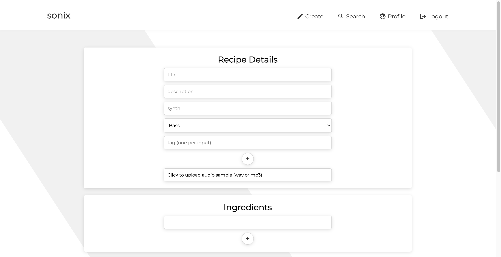
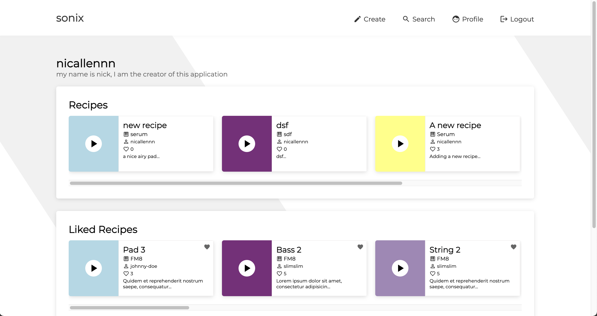

# sonix readme

---

## Overview

Sonix is a sound design recipe cookbook aimed at audio engineers or hobbyists looking to improve their sound design skills.
The application allows users to create/browse/like sound design recipes, which consist of an audio preview, ingredients, and the method to create the sound.

---

## Getting started

- Clone the git repo and run npm install in both the client and server directories.
- You must have mongodb running on your machine, the project uses a database called sonix and has two collections, users and recipes.
- There is a script ‘mock-data-script.js’ to produce mock data for the application. The json file created by this script can be added to mongodb using mongodb compass.
- Run the server first using npm start inside the server directory, the server will start running on port 3001.
- Run the client using npm start inside the client directory, the client will start running on port 3000.

---

## Screenshots of sonix in action

1. Dashboard - entry point for the application

2. Recipe - view a sound design recipe
    

    

3. Create - create a sound design recipe
    

    

4. Profile - view a users profile
    

    

---

## Tech Stack
### Client
* [React](https://reactjs.org/) 
* [Redux](https://redux.js.org/) 
* [React Hook Form](https://react-hook-form.com/)
* [Firebase Storage](https://firebase.google.com/docs/storage) 
* [JWT](https://jwt.io/)
* [Sass](https://sass-lang.com/)

### Server
* [Express](https://expressjs.com/)
* [MongoDB](https://www.mongodb.com/)
* [Mongoose](https://mongoosejs.com/)
* [BCrypt](https://github.com/kelektiv/node.bcrypt.js)
* [JWT](https://jwt.io/))
* [Morgan](https://expressjs.com/en/resources/middleware/morgan.html)

### Design
* [Excalidraw](https://excalidraw.com/)
* [Figma](https://www.figma.com/)

---

## Developers
* [Nick Allen](https://github.com/nicallennn)

